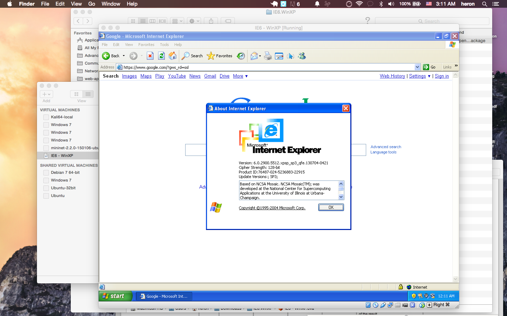

# windows-xp-youtube-fake-view
Testing Youtube Fake View auto script under Windows XP environment.

## Preface

This document is for Network Security course project at CMU.

## Installation

Download virtual machine file for you host machine [here](https://www.modern.ie/en-us/virtualization-tools#downloads).
The testing old IEs are release from Microsoft in 2013 Jan. (See this [site](http://www.pcmag.com/article2/0,2817,2414934,00.asp))

## Setups

- Install Adobe Flash Player
    - Tools -> Internet Options -> Use TSL 1.0: check
    - Visit http://get.adobe.com/flashplayer/
    - Select "Windows XP" and "IE" to download

## Result

Youtube is not supporting IE6 since 2010. See [this article](http://mashable.com/2010/02/23/youtube-ie6/).

## Screenshots

